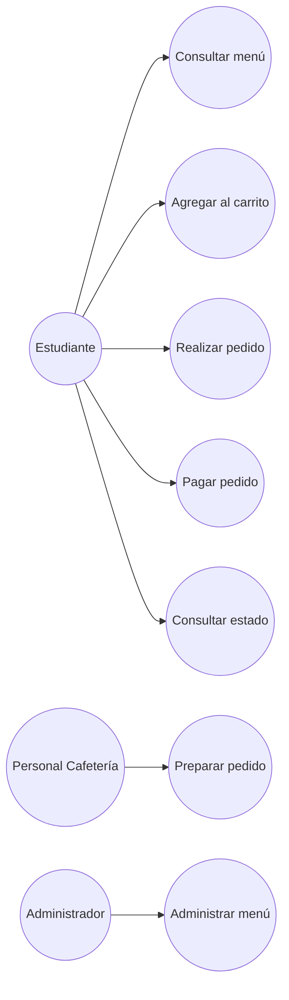
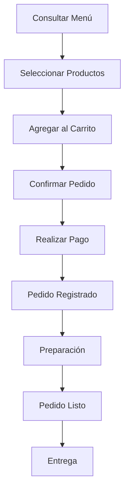
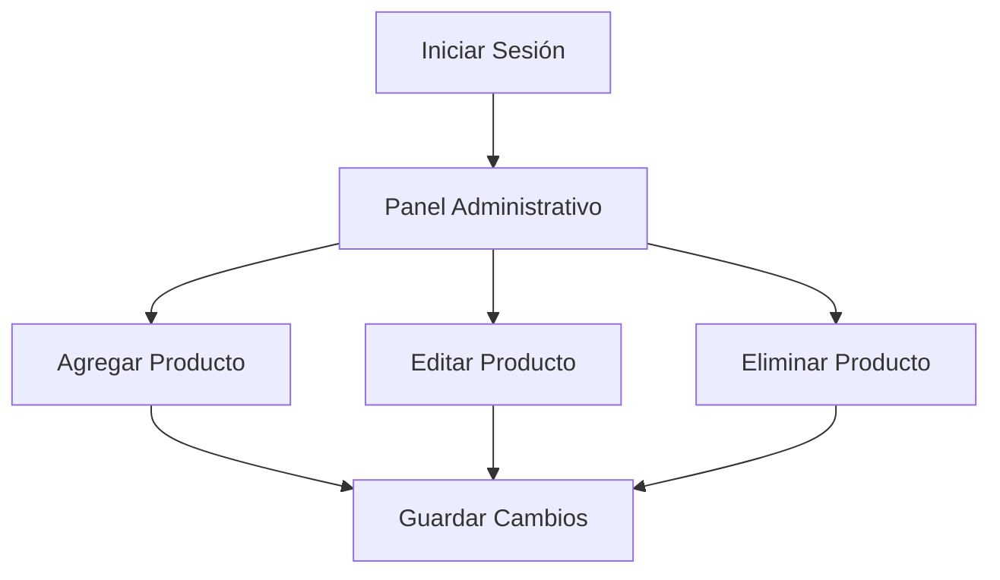

# UML de Casos de Uso con Diagramas Mermaid

## Proyecto

**CafeEDEC Express**

---

# Introducción

En este documento se presentan los diagramas UML elaborados con Mermaid para representar gráficamente las principales funcionalidades del sistema CafeEDEC Express. Estos diagramas muestran la interacción entre los actores y las funciones principales del sistema.

---

# Diagrama 1. Casos de Uso

---

# Descripción

Este diagrama representa las acciones principales que cada actor puede realizar dentro del sistema.

- El estudiante consulta el menú y realiza pedidos.
- El personal prepara los pedidos.
- El administrador administra el menú.

---

# Diagrama 2. Flujo del Pedido

---

# Descripción

El estudiante inicia consultando el menú, selecciona sus productos y confirma el pedido. Después de realizar el pago, el pedido es preparado por el personal hasta quedar listo para su entrega.

---

# Diagrama 3. Flujo del Administrador

---

# Descripción

Este diagrama representa las actividades del administrador para mantener actualizado el menú del sistema.

---

# Actores del Sistema

| Actor | Descripción |
|--------|-------------|
| Estudiante | Consulta el menú, realiza pedidos y consulta el estado del pedido. |
| Personal de Cafetería | Recibe los pedidos y actualiza su estado durante la preparación. |
| Administrador | Gestiona el menú y administra los productos disponibles. |

---

# Beneficios de utilizar UML

- Facilita la comprensión del sistema.
- Permite identificar las funciones principales.
- Mejora la comunicación entre los integrantes del proyecto.
- Sirve como apoyo durante el desarrollo del software.

---

# Conclusión

Los diagramas UML permiten representar de manera gráfica el funcionamiento general de CafeEDEC Express. Gracias a Mermaid, estos diagramas pueden visualizarse directamente desde Visual Studio Code o GitHub, facilitando la documentación y el mantenimiento del proyecto.
